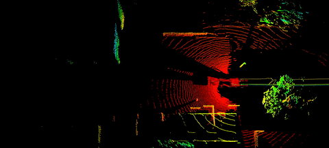
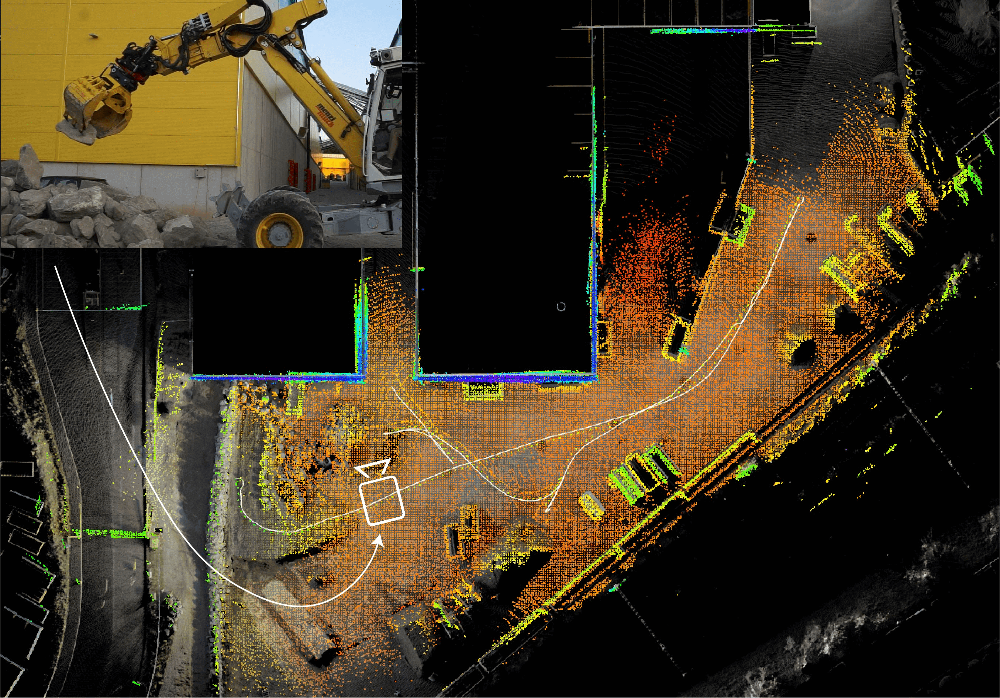

# Graph-MSF: Graph-based State Multi-sensor Fusion for Consistent Localization and State Estimation

**Authors:** [Julian Nubert](https://juliannubert.com/) ([nubertj@ethz.ch](mailto:nubertj@ethz.ch?subject=[GitHub]))
, [Shehryar Khattak](https://www.linkedin.com/in/shehryar-khattak/)
, [Marco Hutter](https://rsl.ethz.ch/the-lab/people/person-detail.MTIxOTEx.TGlzdC8yNDQxLC0xNDI1MTk1NzM1.html)



## Resources 
**[1] ICRA2022, Philadelphia**
* [project page](https://sites.google.com/leggedrobotics.com/gmfcl).
* [paper](https://arxiv.org/pdf/2203.01389.pdf)
* [video](https://youtu.be/syTV7Ui36jg)

## Overview
The presented framework aims for a flexible and fast fusion of multiple sensor modalities. The state estimate is 
published at **imu frequency** through IMU pre-integration with a multi-threaded implementation and book-keeping. 
The adding of the measurements and the optimization of the graph are performed in different threads. 
In contrast to classical filtering-based approaches this graph-based structure also allows for a simple incorporation of
delayed sensor measurements up to the smoothingLag.

There are two intended **use-cases**:

1. Using the dual graph formulation as proosed in [1]. In this part of the implementation there are hard-coded 
components for this specific use-case.
2. A more general graph-based multi-sensor fusion. An example for fusing LiDAR odometry and IMU on the dataset of the 
[ETH Zurich Robotic Summer School](https://ethz-robotx.github.io/SuperMegaBot/) will follow shortly.

**Copyright IEEE**

**Disclaimer:** The framework is still under development and will be updated, extended, and more generalized in the future.

## Modules and Packages
This repository contains the following modules:

1. _graph_msf_: The core library for the sensor fusion. This library is only dependant on Eigen and GTSAM.
2. _graph_msf_ros_: This package provides a basic class for using GraphMsf in ROS. It is dependant on GraphMsf and ROS.
3. _examples_: Examples on how to use GraphMsf and GraphMsfRos.
   - [./examples/excavator_dual_graph](./examples/excavator_dual_graph) from [1]. This is the implementation as presented in the paper.
   - Single-graph standalone fusion example following soon.

## Installation
For the installation instructions please refer to the [./doc/installation.md](./doc/installation.md).

## Example Usage
Instructions on how to use and run the examples can be found in the [./examples/README.md](./examples/README.md).

## Data
We provide some example datasets from our excavator HEAP. The data contains
* IMU measurements,
* LiDAR odometry from CompSLAM,
* Left and Right GNSS measurements,
* and an (arm-)filtered point cloud.

The datasets can be found here: [Google Drive Link](https://drive.google.com/drive/folders/1qZg_DNH3wXnQu4tNIcqY925KZFDu8y0M?usp=sharing).

## Custom Usage
For custom usage, such as the fusion of more sensor measurements, an own class with the desired functionality can be implemented.
This class only has to inherit from the **GraphMsfInterface** base-class.

For usage three functionalities have to be implemented by the user:

1. (ROS)-callbacks or other code snippets can be used to add measurements through the given interface as 
specified [here](graph_msf/include/graph_msf/GraphMsfInterface.h). Examples for this can be seen in the
[excavator_dual_graph](./examples/excavator_dual_graph), where ROS subscribers are used to add the measurements to the graph.
2. Furthermore, the purely virtual functions _publishState_ needs to be implemented. This method is called after each 
arrival of an IMU measurement to publish the state in the desired format.
3. Lastly, _readParams__ is called during initialization, and is needed to load extrinsic parameters inside the 
[StaticTransforms](graph_msf/include/graph_msf/StaticTransforms.h) required for coordinate transformations.
Note that the _StaticTransforms_ class can contain arbitrary extrinsic transformation pairs.

The measurements can be passed to the interface using the _measurements_ specified in 
[./graph_msf/include/measurements](./graph_msf/include/measurements). More measurements can be easily added for
custom usage.

## Paper
If you find this code useful, please consider citing
```
@inproceedings{nubert2022graph,
  title={Graph-based Multi-sensor Fusion for Consistent Localization of Autonomous Construction Robots},
  author={Nubert, Julian and Khattak, Shehryar and Hutter, Marco},
  booktitle={IEEE International Conference on Robotics and Automation (ICRA)},
  year={2022},
  organization={IEEE}
}
```

## Acknowledgements
The authors thank Marco Tranzatto, Simon Kerscher, Dominic Jud, Lorenzo Terenzi, Timo Schoenegg and the remaining HEAP 
team for patiently testing parts of this framework during their experiments. 
